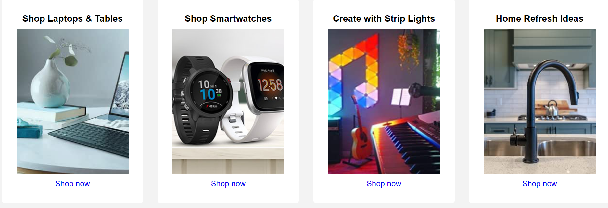

# Introducing Amazon clone UI

## Navbar:-

<nav>

### html code
        

          
        

        

          
Dilaver

          

            <i class="fa-solid fa-location-dot"></i>
            India
          

        

        

          <select name="search" id="search" class="search-select">
            <option>All</option>
            <option>Mobile</option>
            <option>Computer & Asseries</option>
            <option>Groseries</option>
            <option>Shoe</option>
          </select>

          <input type="search" name="search" class="search-input" placeholder="Search Amazon..">
          

            <i class="fa-solid fa-magnifying-glass"></i>
          

        

        

          
            
            EN
          

        
            <select name="Language" id="contery-language">
                <option value="lang"> </option>
                <option value="lang">Us English</option>
                <option value="lang">Hindi</option>
                <option value="lang">Urdu</option>
                <option value="lang">Bangoli</option>
                <option value="lang">Tamil</option>
                <option value="lang">Marathi</option>
            </select>
        
    

    

        
Hello, sign in

        
Account & Lists

    

    

        
Returns

        
& Order

    

    

        <i class="fa-solid fa-cart-arrow-down"></i>
        Cart
    

</nav>

### css this much for navbar

    nav{
        display: flex;
        background-color: rgb(20, 30, 34);
        height: 60px;
        color: white;
        align-items: center;
        justify-content: space-between;
        padding: 0 10px;

    }

    /* nav div{
        height: 45px;
    } */

    /* box-1 */

    /* .logo{
    display: flex;
    justify-content: center;
    align-items: center;
    } */

    nav .logo img{
        margin-top: 10px;
        cursor: pointer;
        width: 120px;
        height: 60px;
    }

    /* box-2 */

    /* .nav-address{
        padding-top: 10px;
    } */
    .nav-address p{
        margin-left: 20px;
        font-size: 0.75rem;
        color: #ccc;
    }

    .nav-address div{
        font-size: 1.2rem;
    }

    /* box-3 */

    .nav-search{
        display: flex;
        justify-content: center;
        align-items: center;
        width: 40%;
    }

    .nav-search select{
        background: #e6e6e6;
        outline:none;
        cursor: pointer;
        border-top-left-radius: 4px;
        border-bottom-left-radius: 4px; 
        width: 50px;
    }
    .nav-search select option{
        text-align: center;
    }

    .nav-search .search-input{
        padding: 0 5px;
        outline: none;
        width: 95%;
        
    }

    .nav-search select, .search-input, .search-logo{
        border: none;
        height: 35px;
    }

    .search-logo{
        width: 50px;
        display: flex;
        justify-content: center;
        align-items: center;
        font-size: 1.2rem;
        background: #febd68;
        color: #000;
        cursor: pointer;
        border-top-right-radius: 4px;
        border-bottom-right-radius: 4px;    
    }

    .search-logo:hover{
        background-color: #e8a042;
        transition: all 0.3s ease-in-out;
    }
    /* box-4 */

    .nav-language{
        display: flex;
        align-items: center;
        
    }

    .nav-language span{
        font-size: .85rem;
    }

    .nav-language span img{
        width: 15px;
        height: 12px;
    }
    .nav-language span select{
        outline: none;
        width: 15px;
        height: 12px;
        cursor: pointer;
    }

    /* box-5 */

    .nav-signin{
        
    }
    .nav-signin p span{
        font-size: 0.75rem;
    }

    /* box-6 */
    .nav-return{
        
    }
    .nav-returns p span{
        font-size: 0.75rem;
    }

    /* box-7 */
    .nav-cart{
        font-weight: bold;
        font-size: 0.90rem;
    }
    .nav-cart i{
        font-size: 25px;
    }

    .border:hover{
        cursor: pointer;
        color: #ccc;
        /* border: 1px solid white; */
        border-radius: 3px;
        transition: all 0.3s ease-in-out;
    }

## Another Nav Panel

##### This much for html 

    

        

          
<i class="fa-solid fa-bars"></i>

          
All

          
Today's Deals

          
Customer Service

          
Registry

          
Gift Cards

          
Sell

        

        

          Shop deals in Electronics
        

      

##### This much for css 

    .panel{
        height: 42px;
        display: flex;
        justify-content: space-between;
        align-items: center;
        padding: 10px 20px;
        background: #222f3d;
        color: #fff;
        font-size: 0.875rem;
    }

    .panel-ops{
        width: 70%;
        display: flex;
        align-items: center;
    }
    .panel-ops p{
        margin-right: 20px;
    }

## Offer image section

##### This much for html 

    <section class="dell-banner"></section>

##### This much for css

    .dell-banner{
    height: 400px;
    background-image: url("https://priyanshu-240499.github.io/Assignments-CSS/Weekly%20Test%20for%20CSS%20(Week-3)/images/hero-img.jpg" );
    background-position: center;
    background-size: cover;
    }

## Product items section

##### This much for html 
    <section class="items">
      

        <h3>Shop Laptops & Tables</h3>
        
        
      
        <a href="#home">Shop now</a>
      

      

        <h3>Shop Smartwatches</h3>
        
        <a href="#home">Shop now</a>
      

      

        <h3>Create with Strip Lights</h3>
      
        
      
        <a href="#home">Shop now</a>
      

      

        <h3>Home Refresh Ideas</h3>
        
        
      
        <a href="#home">Shop now</a>
      

    </section>

 ##### This much for css
    .items{
    display: flex;
    flex-wrap: wrap ;
    justify-content: space-around;
    background-color: #f3f3f3;
    padding: 50px 0;
    gap: 15px;
    }

    .item{
        background-color: #fff;
        border-radius: 5px;
        display: flex;
        flex-direction: column;
        justify-content: center;
        align-items: center;
        max-width: 1280px;
        /* width: 100%; */
        padding: 30px;
        overflow: hidden;
        transform: scale(1);
        transition: transform 0.7s ease-in-out;
    }

    .item:hover{    
        transform: scale(1.08)
    }

    .item img{
        border-radius: 2px;
        width: 230px;
        height: 300px;
        object-fit: cover;
        margin: 10px 0;
    }

    .item a{
        text-decoration: none;
    }
    .item a:hover{
        color: red;
        text-decoration: underline;
    }

### Footer back to top section

##### This much for html 
    

        <a class="border" href="#home">Back to top</a>
      

##### This much for css 
    .foot-title{
    display: flex;
    align-items: center;
    justify-content: center;
    background-color: #37475a;
    height: 60px;
    }

    .foot-title a{
        text-decoration: none;
        color: #fff;
        font-size: 0.875rem;
        font-weight: 600;
    }

## Footer Help Section

##### This much for html 
    

        

          <h4>Get to Know Us</h4>
          
<a href="#home">About us</a>

          
<a href="#home">Careers</a>

          
<a href="#home">Press Release</a>

          
<a href="#home">Amazon Science</a>

        

        

          <h4>Connect with Us</h4>
          
<a href="#home">Facebook</a>

          
<a href="#home">Twitter</a>

          
<a href="#home">Instagram</a>

        

        

          <h4>Make Money with Us</h4>
          
<a href="#home">Sell on Amazon</a>

          
<a href="#home">Protect and Build Your Brand</a>

          
<a href="#home">Amazon Global Selling</a>

          
<a href="#home">Become an Affiliate</a>

          
<a href="#home">InstaFulfillment by Amazongram</a>

          
<a href="#home">Advertise Your Products</a>

          
<a href="#home">Amazon Pay on Merchants</a>

        

        

          <h4>Let Us Help You</h4>
          
<a href="#home">COVID-19 and Amazon</a>

          
<a href="#home">Your Account</a>

          
<a href="#home">Return Centre</a>

          
<a href="#home">100% Purchase Protection</a>

          
<a href="#home">Amazon App Download</a>

          
<a href="#home">Help</a>

        

      

##### This much for css 
    .foot-options{
    background-color: #232f3e;
    display: flex;
    flex-wrap: wrap;
    justify-content: space-evenly;
    width: 100%;
    margin: auto;
    }

    .helps{
        margin: 15px 0;
    }

    .helps h4{
        color: #fff;
        margin: 12px 0;
    }

    .helps p a{
        text-decoration: none;
        color: #ccc;
        font-size: 0.85rem;
        margin: 10px 0;
    }

    .helps p a:hover{
        text-decoration: underline;
    }